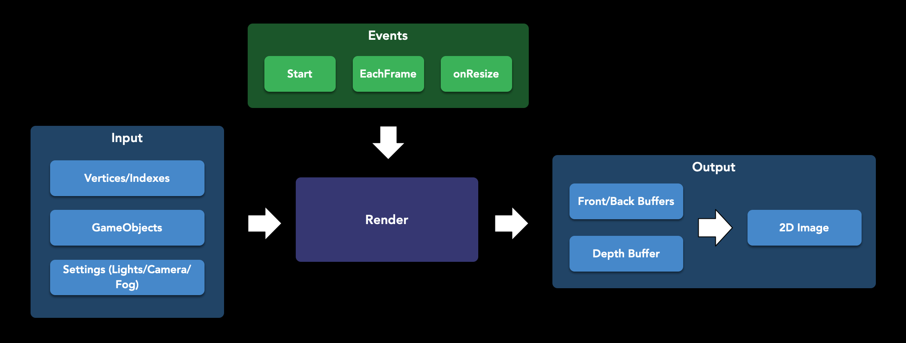
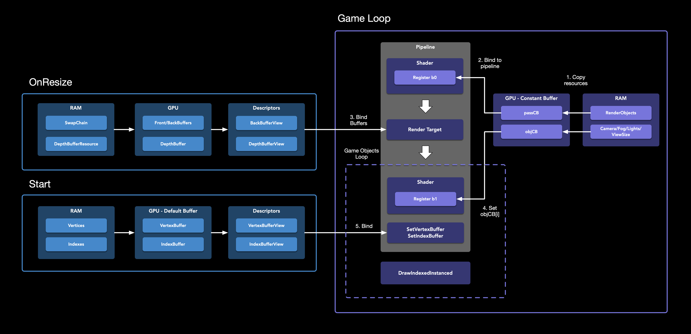

<p align="center"></p>
Parelhoen is a guineafowl in Dutch. These birds are beautiful creatures that came from Africa. I knew a guineafowl that escaped from a farm and found a new home in a car parking. During the COVID pandemic, this bird always put a smile on my face. I named my game engine after it as a nod to its awesomeness. Long live Parelhoen, the brave little bird that brightened up my days!

<!-- ABOUT THE PROJECT -->
## About The Project
<p align="center">
[](https://www.youtube.com/watch?v=kZ0JwX0i2ko)
</p>
This project is a rendering engine that is written in C++ 11 and using DirectX 12 as low-level graphics API. Additionally, I employed the [ImGui](https://github.com/ocornut/imgui) library to create a user interface for configuring various rendering features in real-time. Initially, I integrated the [EnTT](https://github.com/skypjack/entt) header-only library as an Entity-Component-System, but later decided to implement a simpler solution without it.

<!-- INSTALLATION -->
## Installation

I used CMake as a building tool. To run the project, do these steps:

1. Clone the repo
```sh
   git clone https://github.com/kovalgek/GameEngine.git
```
2. Run these scripts in the root directory
3. Open generated project file using Visual Studio 2019

<!-- ROADMAP -->
## Roadmap

- [x] 3d objects in custom format
- [x] Fog
- [x] Mirrors
- [x] Light
- [x] Shadow
- [ ] Support `.obj` 3d file format
- [ ] Network layer
- [ ] Universal layer to support other rendering API like metal

<!-- SCHEMES -->
## Schemes


#### DataFlow

It is a simplified dataflow scheme that shows what data and events drive the rendering.

#### Resources Scheme

It is a detailed scheme showing how and at what stages data binds to the rendering pipeline.

<!-- Acknowledgments -->
## Acknowledgments

I found Frank Luna's book [Introduction to 3D Game Programming with DirectX 12](https://www.amazon.com/Introduction-3D-Game-Programming-DirectX/dp/1942270062) to be incredibly helpful in my development of this project. Instead of simply copying his examples, I aimed to create a game engine with a strong and well-designed architecture. Additionally, I found the experience of programming in C++ to be a refreshing change from my primary job, where I primarily work with Swift and Objective-C.
